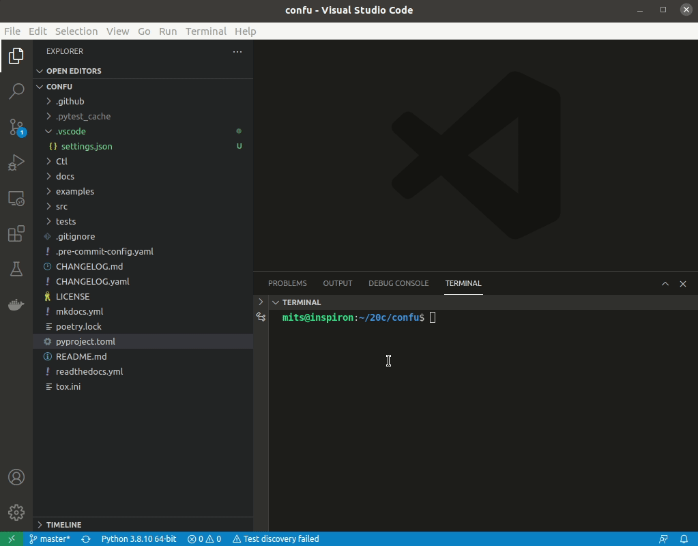
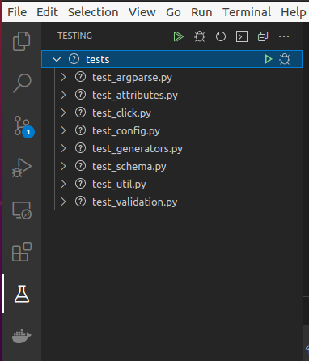

## VS Code Quickstart - Development Environment Setup

1\. Clone repository
```bash
git clone <repo-name>
```
OR (via gh tool)
```bash
gh repo clone <repo-name>
```
2\. Make sure [python poetry](https://python-poetry.org/docs/) is installed globally on your system and then in the root directory run:
```bash
cd <repo-name>
poetry install
```
3\. Select interpreter in VS Code to the virtual environment for the project, if there are multiple, run `poetry env info` to identify  
   


4\. Tests should now discover via VS Code GUI  
   
